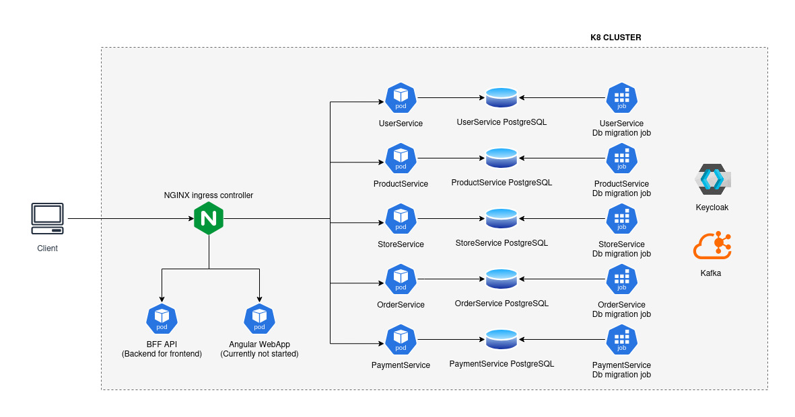

# E-Commerce Backend.

## Architecture


## Tech stack
* Frontend: Angular.
* Backend: ASP.NET Core(.NET 9).
* Database: PostgreSQL.
* Containerization & Orchestration: Docker, Docker Compose, Kubernetes, Helm.
* Automation: Terraform, Bash.
* Event streaming: Kafka.

## Features
* Create, delete, and update store locations.
* Create, delete, and update products, categories, and manufacturers.
* User authentication and role-based authorization.
* User cart + making orders.
* Payment support using Stripe.

## Design
* Used microservice architecture mainly to more deeply learn about how enterprise apps work.
* Containerized the backend using Docker, set up a development environment using Docker Compose and a simple Kubernetes cluster.
* Implemented auth using the Keycloak identity provider.
* Followed a code-first approach to database design using EF Core.
* Created a payment system that currently supports Stripe.

## Setup
### Start the app
#### Docker compose:
* Generate .env files:
  ```bash
    cd scripts && ./setup-env.sh
  ```
* Run from the project root directory: <br>
  ```bash
  docker compose up
  ```
* Note: it takes 1-2 minutes to start all services.
* Note: if you are on Windows, it is recommended to run this in WSL.
#### K8 setup (very experimental, not fully implemented)
* Generate .env files:
  ```bash
  cd scripts
  ./setup-env.sh
  ```
* Execute setup-k8-dev.sh (if dotnet installation fails you will have to add dns records to Docker: https://github.com/dotnet/core/issues/8048): <br>
  ```bash
    cd scripts
    ./setup-k8-dev.sh
  ```
* To start and restart deployments manually, do so using Helm from k8s/umbrella directory.

### Setup keycloak
```bash
  cd terraform/keycloak
  terraform init
  terraform apply -var-file=dev.tfvars
```

### Setup the stripe webhook listener:
```bash
  stripe listen --forward-to=http://localhost:8080/paymentservice/webhook/stripe
```

### Get the admin access token:
* Fetch admin JWT token for development (works only in docker compose): <br>
  ```
  curl -X POST http://localhost:8080/auth/realms/ecommerce-api/protocol/openid-connect/token \
  --data-urlencode client_id=ecommerce-api \
  --data-urlencode client_secret=secret \
  --data-urlencode grant_type=client_credentials
  ```

### OpenAPI endpoints:
* http://localhost:8080/productservice/openapi/v1.json
* http://localhost:8080/storeservice/openapi/v1.json
* http://localhost:8080/userservice/openapi/v1.json
* http://localhost:8080/orderservice/openapi/v1.json
* http://localhost:8080/paymentservice/openapi/v1.json