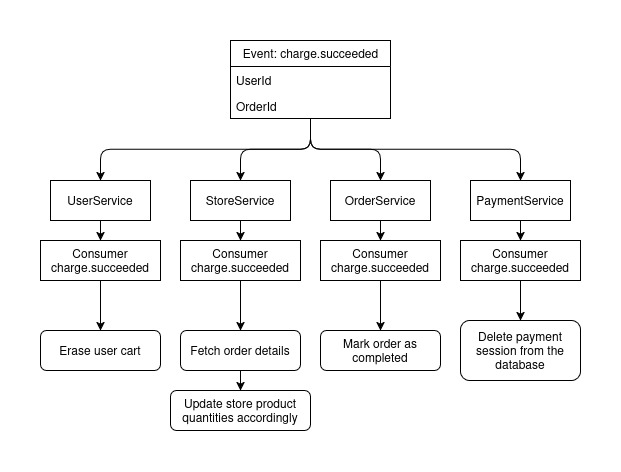

# Order Flow

## Initialize Order Endpoint

**POST** `http://localhost:8080/orderservice/order`

> **Note:** The user’s cart must not be empty. If the cart is empty, the endpoint will return an error.

---

## Order Initialization Flow

The flow below is handled by the **OrderService** microservice in `OrderFlowService.cs`:

1. Generate a UUID for the new order.
2. Retrieve cart products from the **UserService** (this includes user IDs, store location IDs, product IDs, and quantities).
3. Fetch detailed product information from the **StoreService** using the cart items (used to calculate final pricing and construct the order details).
4. Create a new order record and persist it to the database.
5. Create a new payment session and persist it to the database.
6. Return the payment session to the caller.

---

## High-Level Overview: Payment Succeeded Flow

